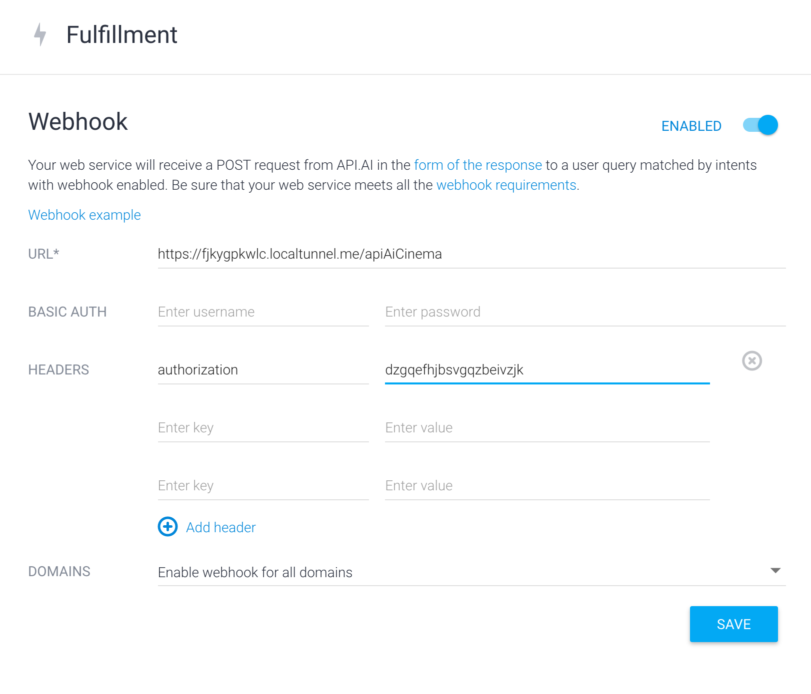

This project implement for now a module to catch web hook from [api.ai](https://api.ai/) when a request is triggered 
on you agent. Soon i'll implement a way to send request to [api.ai](https://api.ai/)

 ### How it works
 
- To run lint and fix `npm run lint`
- To run tests suite `npm run test`
- Start the server `npm start`
- To run up/down migration `npm run migrate {up/down}`

### Configuration

To configure put all config file in the `./src/config/*`.
To use the env variable, remove `.demo` from `.env.demo`.

### WebHook from [api.ai](https://api.ai/)

To receive a callback from [api.ai](https://api.ai/), you must enabled webhook in `Fullfillment` tab and fill all information needed.
To see how it works locally, you need to activate a local tunnel using the following url
 
- `GET http://localhost:3000/localTunnelStart` to start it
- `GET http://localhost:3000/localTunnelStop` to close it

The local tunnel url returned need to be write in the `url` section with the path to the webHook which is actually `/apiAi`

After to be logged in your app you should give you `token` access in the `headers` section : `authorization Bearer ...`
Then, active `Fullfillment` in the targeted intent.



After [api.ai](https://api.ai/) received request, you should received a callback as the following result :
```json
{
    "source": "agent",
    "resolvedQuery": "quelle est la météo",
    "action": "weather",
    "actionIncomplete": true,
    "parameters": {
      "address": "",
      "date-time": ""
    },
    "contexts": [
        {
            "name": "weather_dialog_context",
            "parameters": {
                "date-time.original": "",
                "address": "",
                "date-time": "",
                "address.original": ""
            },
                "lifespan": 2
            },
            {
            "name": "db44589c-29e2-447c-8368-94503e3ccae9_id_dialog_context",
            "parameters": {
                "date-time.original": "",
                "address": "",
                "date-time": "",
                "address.original": ""__
            },
            "lifespan": 2
        },
        {
            "name": "weather_dialog_params_address",
            "parameters": {
                "date-time.original": "",
                "address": "",
                "date-time": "",
                "address.original": ""
            },
            "lifespan": 1
        }
    ]
}
```

And then, the result is sent to the run method of the service `CinemaActionService` which manage the rest of the process.
Including, saving data into firebase database.

And when the process is done, a response is generate to be send to the `api.api`.

### What is include

- `shared` which provide the `FirebaseRepository` which can call with an intent name to find the associated provider `./modules/shared/firebase/`
- `.env` to push all config used
- `api.ai` module with the agents management